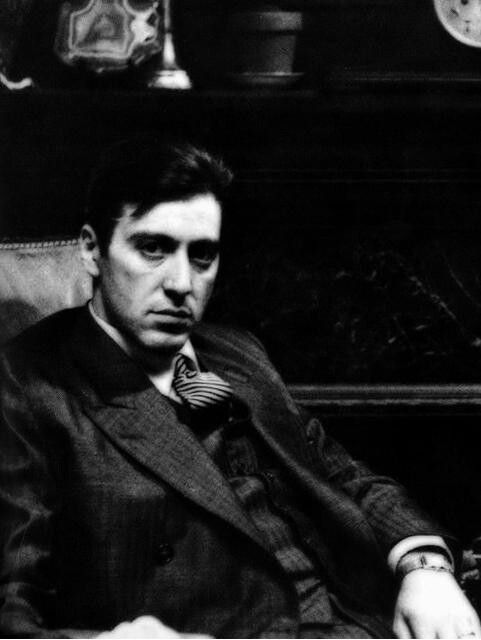
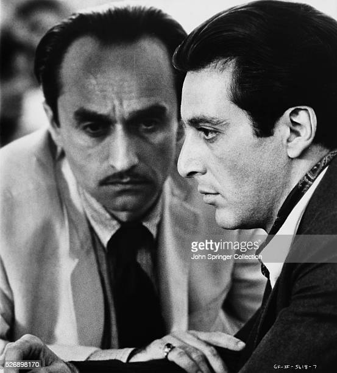
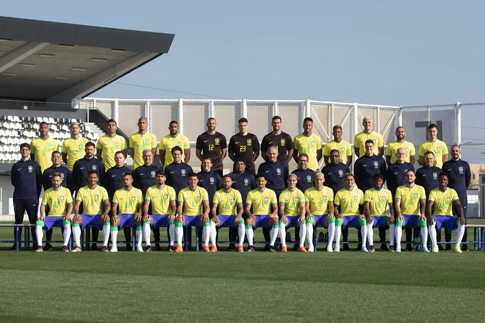

# Face-Detection with Haar Cascades and OpenCV

## Introduction
In this project I will explore face detection using [Haar Cascades](https://en.wikipedia.org/wiki/Haar-like_feature), yet, it is important to notice that this is a face **detection** algorithm, and not a face **recognition** one. It will look to an image and say "yes, it is a face" or "no, there is no face in this image" - it will not identify whose this face belongs to.

The interesting point about this algorithm is that it doesn't slowly "scans" the entire image looking for a face - instead, it pass the cascade of classifiers on it. It means that we will treat the image to a series (a cascade) of classifiers based on some simple features (like line features, edge features, four-rectange featrues, etc.) and once an image fails a classifier, we can stop attempting to detect a face. 

Reference: https://docs.opencv.org/3.4/db/d28/tutorial_cascade_classifier.html

For this project, I'll be using 4 different images:

1. A high quality image with some satisfactory light on the face

{ width=30% }

2. A more low quality image with much more dark areas on the background and on the person's face

{width=30%}

3. A picture with two faces: one parcially looking to the camera and another on profile view.
{ width=30% }

4. An image with a lot of faces  
{ width=90% }

## Code
