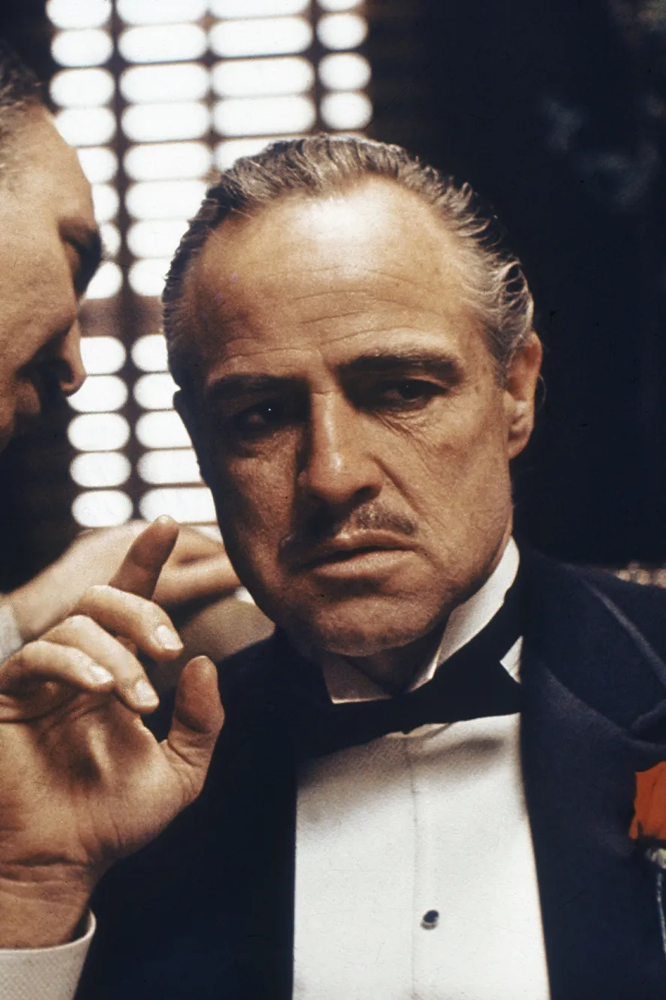

# Face-Detection
 A face detection project utilizing Haar Cascades Feature and OpenCV

In this project I will explore face detection using [Haar Cascades](https://en.wikipedia.org/wiki/Haar-like_feature), having said that, it is important to notice that this is a face **detection** algorithm, and not a face **recognition** one. It will just look to an image and say "yes, it is a face" or "no, there is no face in this image" - it will not identify whose this face belongs to.

The interesting point about this algorithm is that it doesn't slowly "scans" the entire image looking for a face - instead, it pass the cascade of classifiers on it. It means that we will treat the image to a series (a cascade) of classifiers based on some simple features (like line features, edge features, four-rectange featrues, etc.) and once an image fails a classifier, we can stop attempting to detect a face. 

For this project, I'll be using 4 different images:

* A high quality image with some satisfactory light on the face

* A more low quality image with much more dark areas on the background and on the person's face

* A picture with two faces: one parcially looking to the camera and another on perfil

* An image with a lot of faces  